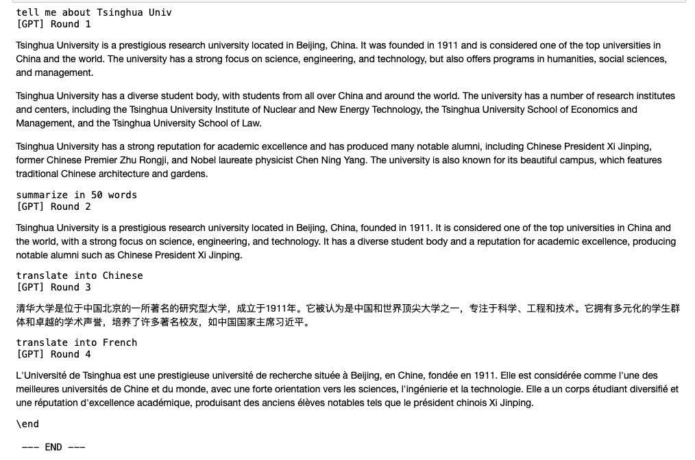
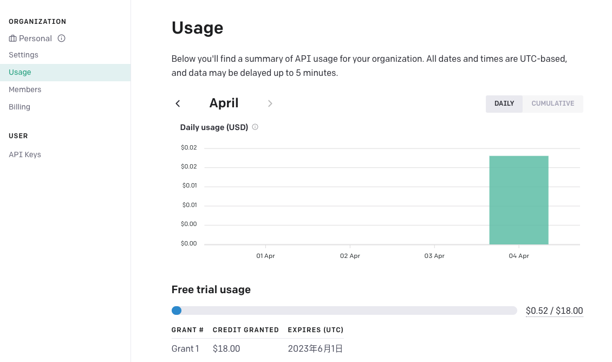

# 通过API调用实现chatGPT的傻瓜教程

## 背景介绍

本文介绍如何通过调用OpenAI的GPT api来实现chatGPT。国内使用chatGPT常遇到：

（1）某些梯子节点无法访问chatGPT网站（"Access Denied"）这一情况愈发严重

（2）与chatGPT对话几轮之后，或间隔一会后无法继续对话（出现Error）必须刷新重来！😤😤

通过api调用能够解决上述2个问题，能够实现比较稳定的连续对话，对访问节点的限制更少。身边有不少同学提出有这个需求。本文给出一个非常简单的GPT api调用教程，有任何不足欢迎反馈！请求大佬赐教！🫡🫡

## Step 1

**Python环境**

电脑上需要有Python环境，以及`pip`安装工具。我用的是3.6以上版本（可以使用anaconda进行python版本的管理）。如何安装Python请自行百度～

## Step 2

**安装所需的包**

注意：国内安装python包是通过镜像站（如清华大学镜像站），所以这一步请不要挂梯子🪜🪜

```python
pip install --upgrade openai
pip install --upgrade python-dotenv
pip install --upgrade langchain
```


---  接下来的步骤需要挂梯子🪜🪜 ---

## Step 3

**注册OpenAI账号，获取专属API Key**👉 👉[OpenAI](https://platform.openai.com/account/api-keys)


API Key是一串包含字母和数字的字符。如图中介绍，不要将你的API Key分享给他人‼️ 这是该账号专属的，**经该API Key调用产生的费用也会由这个账号承担**

## Step 4

**简单的代码**

注意：

- 其中需要将`openai.api_key`替换成**Step 3**中获取的专属API Key
- 

```python
import openai
import os
from IPython.display import display, Markdown, Latex
from langchain.llms import OpenAI
from dotenv import load_dotenv

from langchain.chat_models import ChatOpenAI
from langchain import PromptTemplate, LLMChain
from langchain.prompts.chat import (
    ChatPromptTemplate,
    SystemMessagePromptTemplate,
    AIMessagePromptTemplate,
    HumanMessagePromptTemplate,
)
from langchain.schema import (
    AIMessage,
    HumanMessage,
    SystemMessage
)

openai.api_key  = '请将这里替换成你的API Key'

# system prompt，用于告诉GPT当前的情景，不了解可以放空，没有影响。
# system prompt例如：'You are a marketing consultant, please answer the client's questions in profession style.'
system_content = ''


# 这里使用了langchain包简化与GPT的对话过程，基于的是GPT-3.5，能力与免费版的chatGPT相同。GPT-4需要自行申请加入waitlist
messages = [SystemMessage(content = system_content)]


# 一轮最多对话20次，防止过长的对话。可以通过while循环条件修改。
i = 1
while i <= 20:
    chat = ChatOpenAI(temperature=0,openai_api_key=openai.api_key)
    
    user_input = input()
    
   	# 输入\end结束
    if user_input == '\end': 
        break
    # 输入\clear清空当前对话重来，重置对话场景
    if user_input == '\clear':
        i = 1
        messages = [SystemMessage(content = system_content)] 
        continue
    
    messages.append(HumanMessage(content=user_input))
    
    response = chat(messages)
    messages.append(AIMessage(content = response.content))  # 将GPT回复加入到对话
    
    print("[GPT] Round "+ str(i))
    display(Markdown(response.content))
    
    i = i + 1

print("\n --- END ---")   
```


## Appendix

### 运行成功实例



### 报错

报错`Cannot connect to proxy` 梯子的代理问题，与节点无关，请更换梯子

### 关于API调用收费‼️‼️

本程序中的`gpt-3.5-turbo`接口费用是$0.002 / 1K tokens，**每个账户有 \$18的免费额度**。这个价格是非常便宜的，免费额度对于个人日常需求而言已经足够，如果超过就需要付费了。查看目前使用量及额外付费👉👉[Open AI Account](https://platform.openai.com/account/usage)



### 其余注意事项

- 连续对话作为输入的tokens占用更多，应尽量避免长篇连续对话
- 一次输入和输出的maximum token length有限制，如果是需要润色/翻译长篇论文，需分批输入


本文参考：

https://github.com/dair-ai/Prompt-Engineering-Guide/blob/main/guides/prompts-chatgpt.md
